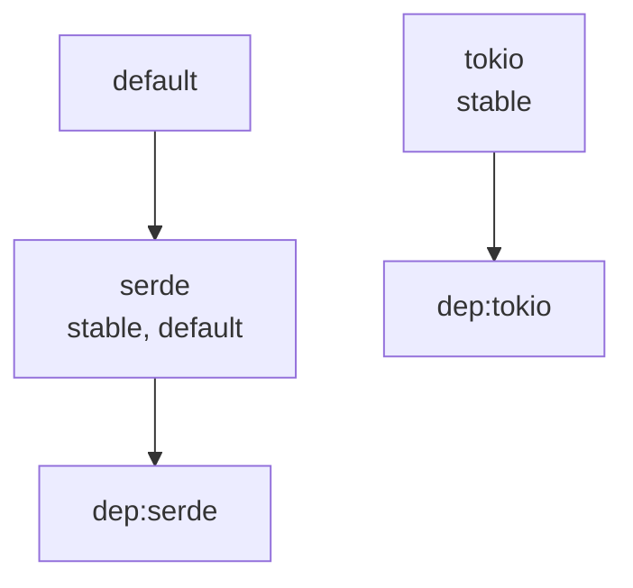

# feature-manifest

`feature-manifest` is a small Rust crate plus Cargo subcommand for documenting, validating, and rendering Cargo feature flags.

It gives crate authors a place to describe feature intent today, using `Cargo.toml`, while also producing outputs that are useful for README tables, docs pages, CI, editor tooling, and workspace audits.

## Why this exists

Cargo features are powerful, but feature intent is often trapped in a raw `[features]` table. `feature-manifest` creates a lightweight authoring layer on top of that table so maintainers can:

- keep every feature documented in one place,
- fail CI when metadata drifts out of sync,
- generate Markdown for docs and READMEs,
- emit JSON for tooling and editor integrations,
- visualize feature relationships with Mermaid,
- work across a whole Cargo workspace when crates share conventions.

## Installation

Once published:

```text
cargo install feature-manifest
```

This installs the `cargo-feature-manifest` binary, which you then invoke as `cargo feature-manifest`.

From source today:

```text
git clone https://github.com/funwithcthulhu/feature-manifest.git
cd feature-manifest
cargo install --path .
```

## Commands

```text
cargo feature-manifest check
cargo feature-manifest markdown > FEATURES.md
cargo feature-manifest json
cargo feature-manifest graph
cargo feature-manifest sync
cargo feature-manifest explain <feature>
```

The default command is `check`, so `cargo feature-manifest` is valid shorthand.

During local development, you can run the same commands with:

```text
cargo run -- check
cargo run -- markdown
cargo run -- json
cargo run -- graph
cargo run -- sync
cargo run -- explain serde
```

You can point the tool at another crate with either a crate directory or a direct manifest path:

```text
cargo feature-manifest check --manifest-path path/to/crate
cargo feature-manifest markdown --manifest-path path/to/crate/Cargo.toml
```

Workspace-aware examples:

```text
cargo feature-manifest --workspace check --manifest-path path/to/workspace
cargo feature-manifest --package my-crate explain serde --manifest-path path/to/workspace
cargo feature-manifest --workspace json --manifest-path path/to/workspace
```

## Workflow

The most useful day-to-day flow is:

1. Add or change features in `Cargo.toml`.
2. Run `cargo feature-manifest sync` to scaffold any missing metadata entries.
3. Fill in real descriptions and status flags.
4. Run `cargo feature-manifest check` in CI.
5. Generate `FEATURES.md` or docs snippets with `markdown`.

## Metadata format

Structured form:

```toml
[features]
default = ["serde"]
serde = ["dep:serde"]
tokio = ["dep:tokio"]
unstable = []
internal-codegen = []

[package.metadata.feature-manifest.features]
serde = { description = "Enables Serialize/Deserialize impls." }
tokio = { description = "Enables async APIs backed by Tokio." }
unstable = { description = "Experimental APIs; semver not guaranteed.", unstable = true }
internal-codegen = { description = "Internal codegen support.", public = false }

[[package.metadata.feature-manifest.groups]]
name = "runtime"
description = "Choose one async runtime backend."
members = ["tokio", "async-std"]
mutually_exclusive = true
```

Flat shorthand is also supported:

```toml
[package.metadata.feature-manifest]
serde = "Enables Serialize/Deserialize impls."
tokio = { description = "Enables async APIs backed by Tokio." }
```

Supported metadata fields:

| Field | Type | Meaning |
| --- | --- | --- |
| `description` | `string` | Human-facing explanation of the feature. Required for a clean `check`. |
| `public` | `bool` | Whether the feature should appear in public-facing rendered output. Defaults to `true`. |
| `unstable` | `bool` | Marks the feature as experimental. |
| `deprecated` | `bool` | Marks the feature as deprecated. |
| `allow_default` | `bool` | Acknowledges that a private, deprecated, or unstable feature is intentionally default-enabled. |
| `note` | `string` | Extra freeform context appended in Markdown output. |

Group fields:

| Field | Type | Meaning |
| --- | --- | --- |
| `name` | `string` | Group identifier used in reports. |
| `description` | `string` | Human-facing explanation of the group. |
| `members` | `string[]` | Features that belong to the group. |
| `mutually_exclusive` | `bool` | When `true`, flags invalid default combinations. |

## What `check` validates

- Features declared in `[features]` but missing metadata.
- Metadata entries that do not correspond to a real feature.
- Empty or missing descriptions.
- Unstable, deprecated, or private features that are enabled by default without `allow_default = true`.
- Mutually exclusive groups that default-enable more than one member.
- Unknown or duplicate feature names inside configured groups.
- Unrecognized feature-reference syntax in feature definitions or default members.

## Output goals

- `markdown` produces a docs-friendly feature table.
- `json` emits a versioned machine-readable schema.
- `graph` emits a Mermaid dependency graph for feature relationships.
- `explain` turns one feature into a focused maintainer- or consumer-facing summary.

Example JSON output shape:

```json
{
  "schema_version": 1,
  "packages": [
    {
      "package_name": "demo",
      "manifest_path": "Cargo.toml",
      "default_feature_set": ["serde"],
      "features": [
        {
          "name": "serde",
          "default_enabled": true,
          "has_metadata": true,
          "enables": [
            {
              "kind": "dependency",
              "name": "serde"
            }
          ],
          "metadata": {
            "description": "Enables Serialize/Deserialize impls.",
            "public": true,
            "unstable": false,
            "deprecated": false,
            "allow_default": false,
            "note": null
          }
        }
      ]
    }
  ]
}
```

The JSON schema is intentionally versioned so editor integrations and automation can target a stable contract.

Example `explain` output:

```text
Feature: `serde`
Package: demo
Description: Enables Serialize/Deserialize impls.
Default enabled: yes
Visibility: public
Status: stable
Metadata table: feature-manifest
Enables: `dep:serde`
Included in default feature set: yes
Groups: none
Required by: no feature references
```

Example Mermaid output:



## Workspace Support

When `--workspace` is set, `feature-manifest` uses `cargo metadata` to discover workspace members and runs the selected command across all of them. When a workspace has multiple members, the default selection mode is intentionally strict: you must choose `--workspace` or `--package <name>`.

## Dogfooding Fixtures

A small single-package sample crate lives at [`fixtures/basic/Cargo.toml`](fixtures/basic/Cargo.toml), and a workspace fixture lives at [`fixtures/workspace/Cargo.toml`](fixtures/workspace/Cargo.toml).

You can try the current CLI against them with:

```text
cargo run -- check --manifest-path fixtures/basic
cargo run -- markdown --manifest-path fixtures/basic
cargo run -- graph --manifest-path fixtures/basic
cargo run -- --workspace check --manifest-path fixtures/workspace
cargo run -- --package workspace-cli-fixture explain color --manifest-path fixtures/workspace
```

## Architecture

The crate is now split into a few focused layers:

- `discover`: workspace/package selection via `cargo metadata`
- `parse`: TOML parsing plus `sync`-time manifest editing
- `model`: typed feature/reference domain types
- `render`: Markdown, Mermaid, and `explain` output
- `validate`: CI-oriented lint rules
- `json_output`: stable machine-readable schema

That split keeps the Cargo-facing discovery code separate from the pure feature model and makes renderer/test work much safer.

## Testing

The repo includes:

- unit tests for parsing and validation,
- integration tests for CLI behavior,
- snapshot tests for Markdown, JSON, and Mermaid output,
- fixture crates for both single-package and workspace flows.

Run everything with:

```text
cargo test
```

## Publish Checklist

- Confirm the version, `CHANGELOG.md`, and README examples are ready for the release.
- Run `cargo fmt`, `cargo test`, and `cargo publish --dry-run`.
- Install the binary locally with `cargo install --path .` and smoke-test the CLI against a real crate or workspace.
- Generate and review `FEATURES.md` output from a non-trivial fixture crate.

## License

Licensed under either of the following, at your option:

- Apache License, Version 2.0
- MIT license
