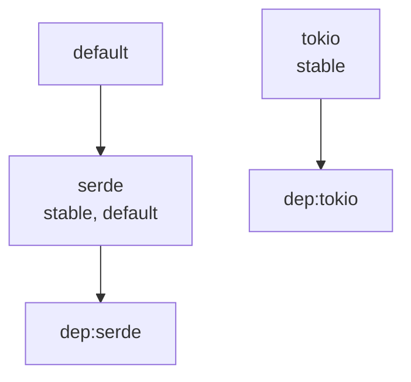

# feature-manifest

`feature-manifest` is a small Rust crate plus Cargo subcommand for documenting, validating, and rendering Cargo feature flags.

It gives crate authors a place to describe feature intent today, using `Cargo.toml`, while also producing outputs that are useful for README tables, docs pages, CI, and editor tooling.

As of `2026-05-02`, a quick `cargo search` for both `feature-manifest` and `cargo-feature-manifest` returned no matches, so the crate name appears open on crates.io.

## Why this exists

Cargo features are powerful, but feature intent is often trapped in a raw `[features]` table. `feature-manifest` creates a lightweight authoring layer on top of that table so maintainers can:

- keep every feature documented in one place,
- fail CI when metadata drifts out of sync,
- generate Markdown for docs and READMEs,
- emit JSON for tooling and editor integrations,
- visualize feature relationships with Mermaid.

## Installation

Once published:

```text
cargo install feature-manifest
```

This installs the `cargo-feature-manifest` binary, which you then invoke as `cargo feature-manifest`.

From source today:

```text
git clone https://github.com/funwithcthulhu/feature-manifest.git
cd feature-manifest
cargo install --path .
```

## Commands

```text
cargo feature-manifest check
cargo feature-manifest markdown > FEATURES.md
cargo feature-manifest json
cargo feature-manifest graph
```

The default command is `check`, so `cargo feature-manifest` is valid shorthand.

During local development, you can run the same commands with:

```text
cargo run -- check
cargo run -- markdown
cargo run -- json
cargo run -- graph
```

You can point the tool at another crate with either a crate directory or a direct manifest path:

```text
cargo feature-manifest check --manifest-path path/to/crate
cargo feature-manifest markdown --manifest-path path/to/crate/Cargo.toml
```

## Metadata format

Structured form:

```toml
[features]
default = ["serde"]
serde = ["dep:serde"]
tokio = ["dep:tokio"]
unstable = []
internal-codegen = []

[package.metadata.feature-manifest.features]
serde = { description = "Enables Serialize/Deserialize impls." }
tokio = { description = "Enables async APIs backed by Tokio." }
unstable = { description = "Experimental APIs; semver not guaranteed.", unstable = true }
internal-codegen = { description = "Internal codegen support.", public = false }

[[package.metadata.feature-manifest.groups]]
name = "runtime"
description = "Choose one async runtime backend."
members = ["tokio", "async-std"]
mutually_exclusive = true
```

Flat shorthand is also supported:

```toml
[package.metadata.feature-manifest]
serde = "Enables Serialize/Deserialize impls."
tokio = { description = "Enables async APIs backed by Tokio." }
```

Supported metadata fields:

| Field | Type | Meaning |
| --- | --- | --- |
| `description` | `string` | Human-facing explanation of the feature. Required for a clean `check`. |
| `public` | `bool` | Whether the feature should appear in public-facing rendered output. Defaults to `true`. |
| `unstable` | `bool` | Marks the feature as experimental. |
| `deprecated` | `bool` | Marks the feature as deprecated. |
| `allow_default` | `bool` | Acknowledges that a private, deprecated, or unstable feature is intentionally default-enabled. |
| `note` | `string` | Extra freeform context appended in Markdown output. |

Group fields:

| Field | Type | Meaning |
| --- | --- | --- |
| `name` | `string` | Group identifier used in reports. |
| `description` | `string` | Human-facing explanation of the group. |
| `members` | `string[]` | Features that belong to the group. |
| `mutually_exclusive` | `bool` | When `true`, flags invalid default combinations. |

## What `check` validates

- Features declared in `[features]` but missing metadata.
- Metadata entries that do not correspond to a real feature.
- Empty or missing descriptions.
- Unstable, deprecated, or private features that are enabled by default without `allow_default = true`.
- Mutually exclusive groups that default-enable more than one member.
- Unknown or duplicate feature names inside configured groups.

## Output goals

- `markdown` produces a docs-friendly feature table.
- `json` emits normalized machine-readable metadata.
- `graph` emits a Mermaid dependency graph for feature relationships.

Example JSON output shape:

```json
{
  "package_name": "demo",
  "features": {
    "serde": {
      "name": "serde",
      "default_enabled": true,
      "dependencies": ["dep:serde"],
      "has_metadata": true,
      "metadata": {
        "description": "Enables Serialize/Deserialize impls.",
        "public": true,
        "unstable": false,
        "deprecated": false,
        "allow_default": false,
        "note": null
      }
    }
  }
}
```

Example Mermaid output:



## Dogfooding Fixture

A small sample crate lives at [`fixtures/basic/Cargo.toml`](fixtures/basic/Cargo.toml). You can try the current CLI against it with:

```text
cargo run -- check --manifest-path fixtures/basic
cargo run -- markdown --manifest-path fixtures/basic
cargo run -- graph --manifest-path fixtures/basic
```

## Publish Checklist

- Confirm the version, `CHANGELOG.md`, and README examples are ready for the release.
- Run `cargo fmt`, `cargo test`, and `cargo publish --dry-run`.
- Install the binary locally with `cargo install --path .` and smoke-test the CLI against a real crate.
- Generate and review `FEATURES.md` output from a non-trivial fixture crate.

## Why this layout

The crate is split into a reusable library and a `cargo-feature-manifest` binary so the validation logic stays testable and future integrations can call the library directly.

## License

Licensed under either of the following, at your option:

- Apache License, Version 2.0
- MIT license
